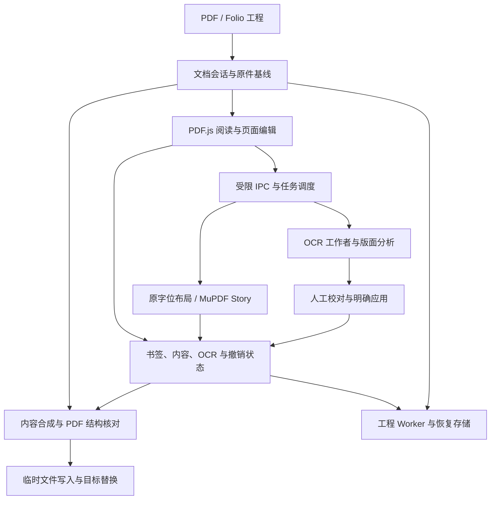

# Folio PDF Studio

面向 Windows x64 的离线 PDF 工作台，重点解决长文档的**书签生成与整理、页面内文字编辑、OCR 识别与校对**。阅读、版面分析、字体匹配和 OCR 在本地运行；完整便携包无需另装 Python、Node.js 或模型。

**当前发布版：1.2.0 RC1-P1** · [下载 Latest](https://github.com/ionize1080/Folio/releases/latest) · [指定版本与校验文件](https://github.com/ionize1080/Folio/releases/tag/v1.2.0-rc1-p1)

> Latest 表示当前默认下载版本。版本名称仍为 RC1-P1，已有功能的适用范围和已知问题见下文；数字字体保真、段落边界与部分 OCR 漏字的后续修复尚未发布。

[已实现功能](#已实现功能) · [项目架构](#项目架构) · [已知问题](#已知问题与适用边界) · [下一步计划](#下一步功能计划) · [开发与测试](#开发构建与测试)

## 下载与使用

在 Release 页面按用途下载：

| 文件 | 用途 |
| --- | --- |
| `Folio-PDF-Studio-1.2.0-RC1-P1-portable-win-x64.zip` | Windows x64 便携运行包，完整解压后运行 `Folio.exe` |
| `Folio-PDF-Studio-1.2.0-RC1-P1-source.zip` | 完整离线源码交付包，包含随包引擎、模型及运行资源 |
| `Folio-PDF-Studio-1.2.0-RC1-P1-validation.json` | Windows 打包程序与界面验证记录 |
| `Folio-PDF-Studio-1.2.0-RC1-P1-SHA256.txt` | 发布文件的 SHA-256 校验值 |

请保留解压后的完整目录，包括 `resources`、`locales` 和 DLL。GitHub 自动生成的 **Source code (zip/tar.gz)** 是仓库快照，与上述完整离线 `source.zip` 的资产范围不同。

基本流程：打开或拖入 PDF → 编辑书签、页面内容或校对 OCR → 应用修改 → 保存 PDF。“完成编辑”或“应用修改”更新当前会话，**仍需保存文件**。需要继续调整段落结构、OCR 校对和内容编辑时，通过“更多工具 → 导入 / 导出”保存 `.folio` 工程。

| 快捷键 | 操作 |
| --- | --- |
| `Ctrl+O` / `Ctrl+S` / `Ctrl+Shift+S` | 打开 / 保存 / 另存为 |
| `Ctrl+F` / `F3` / `Shift+F3` | 搜索正文 / 下一个 / 上一个结果 |
| `Ctrl+Z` / `Ctrl+Y` | 撤销 / 重做，输入期间优先作用于当前段落 |
| `Ctrl+Enter` | 页面编辑中完成当前段；OCR 校对中确认并前往下一处 |
| `Ctrl+Shift+B` | 从选中文字或当前视图新建书签 |
| `F2` / `Delete` | 书签树中改名 / 删除所选子树 |
| `Ctrl+0` / `Ctrl+1` / `Ctrl+2` | 适合页面 / 实际大小 / 适合宽度 |
| `Alt+←` / `Alt+→` | 阅读区返回 / 前进；书签树中用于升降级 |

快捷键按所在区域解释，可在首选项中配置。当前主要交付平台为 Windows x64；Linux 上的引擎或浏览器测试不等于提供 Linux 桌面发行版。

## 已实现功能

以下以主线合入的 **1.2.0 RC1-P1** 源码为基线。功能存在并不表示任意 PDF 都能无损处理；复杂结构和已知缺陷单独列在后文。

### 1. 阅读、定位与日常文档操作

- PDF 阅读、缩放、适合页面/宽度、连续浏览、缩略图与视图前进/返回。
- 正文搜索、文字选择与复制、书签导航；可收起的书签侧栏和属性面板，明暗主题。
- 页面与高倍缩放瓦片按需渲染，使用缓存预算、缩放锚点和过期渲染取消降低长文档开销。
- 拖入 PDF 或 Folio 工程，切换文档前处理未保存更改；多文件拖入时选择要打开的文件。
- 基础批注、指定页面旋转、页面提取、末尾追加另一 PDF、当前页 PNG 导出与文档属性编辑。
- 加密文档的密码处理；通过 qpdf/pikepdf 导出无密码副本，错误密码可重试，取消不写文件。

**页面工具的范围：**提取以原始文档为基础，不包含尚未另存的修改，也不复制整本书签树；追加 PDF 前先保存当前编辑，追加文件的书签不自动合并。PNG 导出以页面画布为基础，未保存批注应先保存并重新打开后再导出。

### 2. 书签创建、批量编辑与自动生成

书签是核心工作流，**自动书签入口常驻主工具栏**。

| 能力 | 当前实现 |
| --- | --- |
| 树形编辑 | 新增同级/子项、改名、删除、多选、剪切/复制/粘贴、拖动排序、跨层移动、升降级、展开/折叠 |
| 属性与目标 | 批改粗体、斜体、颜色，以及可编辑目标的页码、坐标和缩放；保留并核对原始动作来源 |
| 筛选 | 标题文本或正则、大小写选项、物理页码；可选择真正匹配项并批量处理，祖先路径用于保持上下文 |
| 批量规则 | 查找替换、目标参数调整、修改前后详情预览、报告导出与整批撤销 |
| 自动生成 | 自定义多层级规则、捕获组标题、文字来源选择、当前页测试、页范围扫描预览；支持字号、目录文本和页间隔等入口 |
| 文字重组 | 同行片段拼接与可调基线容差，可选相邻跨行标题合并；提供命中、忽略、冲突与缺少父级诊断 |
| 插入与去重 | 根层追加、替换、插入所选前后或作为子项；生成时跳过重复匹配，整理时按标题、页码及目标位置容差去重 |
| 正则拆分 | 同级分隔、独立规则提取和父子层级拆分；规则读取完整原题，支持预览、子项迁移及目标继承 |
| 目标校准 | 在页面文字中定位候选并核对匹配片段，允许保留人工选择及原目标 |
| 跳转留白 | 按视觉留白调整顶部位置，支持 mm/pt、所选/所选及子项/全部范围，预览跳转前后差异 |
| 规则记忆 | 按操作与文档恢复参数，最近规则、命名收藏及导入/导出；恢复规则后重新计算预览 |
| 交换格式 | 导入/导出 Folio JSON 和目录 TXT；未实现 PDF-XChange 专有书签交换格式 |

坐标、留白与页范围在预览中核对后应用。跨文件导入不会照搬原始动作字典：可解析本地目标转为显式目标，不可解析动作会提示并回退定位，不能承诺跨文件动作完全等价。

### 3. 页面内段落编辑与字体处理

- 直接在阅读区点击段落编辑，支持输入、退格、拖选、复制粘贴及新建文字；输入法组合阶段保留草稿。
- 支持字符范围的字体、字号、粗斜体、颜色，以及段落对齐、行距、段前后距、缩进和格式刷。
- 字体列表按文档、内置、系统和最近使用组织，提供本地化名称、别名搜索、真实样例与 TTC 字面选择。
- 保留原始字符原点、基线和边界。满足条件的小修改尝试保持原字位；需要重新布局时使用 MuPDF Story，并明确进入段落重排。
- 对单对象、单行、等字符数、已有编码且不增宽等受限情形，支持保持原字体资源的局部纠错；不满足条件时采用内容片段路径。
- 支持段落拆分、合并、人工结构锁定，同页文本框连接、顺序调整和断开，以及同一文本流内的分栏续排。
- 文本框支持位置、尺寸、固定范围和扩展方向设置；碰撞或溢出给出提示，并提供相应的保留/调整操作。
- 提供段落原文对照、字体替代明细，以及全页并排、叠加和像素变化网格对照。

**RC1-P1 的改进：**连续输入复用已匹配且覆盖新增字符的字体，缓存字体覆盖信息和选择结果；过时草稿不再继续扩容重排；标点处光标按字号与基线计算。首次匹配和首次页面分析仍有额外开销，不能据此承诺所有文档都能即时输入。

现有字体匹配使用覆盖、轮廓、形状和字宽信息。**未嵌入字体解析与混合字体保真仍存在已知问题**，并非任意原字体均能无损续写。

### 4. 图片、对象与简单表格

- 提供文字、路径等对象的受限编辑入口；图片实例可替换、设置适配方式和可恢复裁切，保留源图供工程续编。
- 简单有线表格支持单元格文字、行高联动、行列插入/删除、列宽调整、矩形合并/拆分、排版预览及撤销。
- 表格可导出 CSV 和 XLSX。XLSX 单元格按文本写入，保留前导零、长编号、日期原文和合并范围；CSV 处理引号、换行及易被解释为公式的开头。
- 表格结构调整约束在当前区域内，空间不足或对象映射不可靠时提示或保留原内容。复杂无框线、倾斜、嵌套及跨页表格不属于已完整支持范围。

### 5. 离线 OCR、校对与双层 PDF

| 环节 | 当前实现 |
| --- | --- |
| 识别引擎 | RapidOCR + ONNX Runtime CPU；提供 PP-OCRv6 small 和 PP-OCRv5 mobile 配置 |
| 范围与资源 | 指定页范围或框选局部区域；180/240/300 DPI；自动、低占用、高性能和自定义并行页数/线程/文字行批量 |
| 调度 | 独立 OCR 工作者、逐页进度、停止保留结果，以及相同文档和设置的已完成页续做 |
| 跳过策略 | 依据已有文字覆盖判断是否跳过，或选择“任意已有文字”的旧策略；局部区域有独立处理逻辑 |
| 校对 | 单页/连续滚动模式，文字与页面双向定位、疑点跳转、确认下一处、暂缓、人工修改与校对草稿恢复 |
| 语言与字形 | 简中、繁中、英文等校对提示选项；保留其他识别文字；可保留原结果或转换简繁字形 |
| 输出 | 应用校对结果生成可搜索、可复制的隐藏文字层，保留扫描图像；提供文字/识别框预览 |
| 重复应用 | 新建 OCR 层带 Folio 标识，重新打开后可替换已知 Folio 层；不会自动删除其他软件产生的隐藏文字层 |

语言勾选用于校对提示，**不扩展模型本身的语言能力**。字形转换发生在识别之后，原始识别文字和引擎置信度仍保留。修改隐藏 OCR 层不会直接修改扫描图上的可见文字。

当前已支持框选局部识别；下一步计划中的“补识别”进一步要求复用既有检测框、比较候选、保护人工校对并可靠合并结果，两者不能等同。

### 6. 保存、工程、撤销与恢复

- 原始 PDF 作为会话基线保存，书签、旋转、批注、OCR 和内容修改作为独立状态参与合成。
- `.folio` v2 使用 ZIP STORE 容器，包含原 PDF、状态、内容资产及哈希清单；支持读取旧版 v1 工程，保存为 v2 后旧版程序不能读取。
- 大型 OCR/内容片段通过不可变版本引用参与历史，减少撤销记录中的重复序列化；当前编辑与文档操作分别提供撤销/重做。
- 工程编解码放到 Worker，桌面保存按块传输；写入同目录临时文件并刷盘后替换目标，失败时保护原目标内容。
- IndexedDB 保存按会话区分的恢复草稿，源文档和碎片去重并检查完整性；可选择、恢复或删除草稿。
- 损坏工程、资产缺失或恢复校验失败会停止切换/恢复；配额失败保留上一次完整快照。

工程保存原始内容和编辑状态，适合续编。普通 PDF 输出不保证重新打开后还能恢复同一段落编辑模型；普通编辑和保留历史的工程也不是安全涂黑。

## 项目架构

### 技术栈与分工

| 层次 | 技术 / 模块 | 职责 |
| --- | --- | --- |
| 桌面容器 | Electron、`main.cjs`、`preload.cjs` | 窗口、文件交互、受限 IPC、原生任务与运行资源管理 |
| 页面工作区 | ES modules、HTML/CSS、PDF.js | 阅读渲染、文本选择、编辑光标、书签树、OCR 校对和属性交互 |
| 结构与计算 | pdf-lib、Web Workers | PDF 结构、书签与批注写入，规则计算、筛选、工程编解码 |
| 原生 PDF | Python、pypdfium2/PDFium、PyMuPDF、pikepdf/libqpdf | 对象解析、字形几何、内容合成、排版输出及解密 |
| 确定性排版 | 原字位布局、MuPDF Story | 局部修改和受控段落重排，输出对应的预览及 PDF 片段 |
| 本地识别 | RapidOCR、RapidLayout、ONNX Runtime、PicoDet CDLA | OCR 和版面区域候选；不使用生成模型自动改写正文 |
| 状态与持久化 | 会话修订号、内容寻址资产、ZIP 工程、IndexedDB | 过期结果拒绝、撤销、缓存、工程保存及异常恢复 |

### 运行链路



阅读渲染、PDF 结构处理、排版及 OCR 分工协作。原生桥在单个进程内串行请求，不同工作进程隔离内容、背景、字体、排版及 qpdf 等任务；OCR 另有页级调度。取消代次和文档修订号用于拒绝过期结果，但已进入某次原生调用的工作不一定能立即中断。

### 主要源码入口

| 文件 / 目录 | 主要职责 |
| --- | --- |
| `main.cjs`、`preload.cjs` | 桌面启动、IPC 发送者校验、文件能力票据、原生进程入口 |
| `src/app.mjs`、`src/session-state.mjs` | 命令协调、活动文档、对话框、文档身份与修订号；`app.mjs` 仍较集中，尚未完成全面模块化 |
| `src/viewer.mjs` | 页面/瓦片虚拟化、渲染缓存、缩放锚点和选择 |
| `src/bookmark-*.mjs`、`src/generation.mjs`、`src/text-lines.mjs` | 书签树、属性、筛选、去重/拆分、文字重组与规则生成 |
| `src/*-worker.mjs` | PDF 结构、规则生成、批量处理、筛选、校准和工程等后台计算 |
| `src/flow-ui.mjs`、`src/flow-model.mjs`、`src/flow-page-model.mjs`、`src/flow-structure.mjs` | 页上编辑、字符/段落模型、选区、文本框接续及结构修正 |
| `flow-layout.cjs`、`flow-validation.cjs` | 专用排版进程与输入模型校验；产品路径不再依赖旧 Chromium 排版器 |
| `native/original_layout.py`、`native/original_patch.py`、`native/story.py` | 原字位与局部行布局、受限原对象纠错、Story 段落排版 |
| `native/font_match.py`、`native/font_similarity.py`、`native/system_fonts.py` | 字体解析、覆盖检查、候选字形比较与系统字体信息 |
| `native/content.py`、`native-bridge.cjs` | 原对象来源校验、版本化内容片段合成、请求隔离与结果缓存 |
| `ocr-jobs.cjs`、`native/worker.py`、`src/ocr-*.mjs` | OCR 页任务、引擎执行、结果传输、校对状态和应用 |
| `src/table-*.mjs`、`native/table_*.py`、`native/image_edit.py` | 表格模型、结构/尺寸调整、输出和图片实例处理 |
| `src/pdf-core.mjs`、`src/pdf-worker.mjs` | PDF 结构保存、书签动作保真与合成来源核对 |
| `source-store.cjs`、`src/native-source.mjs` | 原 PDF 注册、只读句柄及租约，减少重复全文件传输与落盘 |
| `src/model.mjs`、`src/edit-assets.mjs`、`src/portable-state.mjs` | 小状态历史、不可变内容版本、内容寻址资产和资源预算 |
| `src/project.mjs`、`src/project-worker.mjs`、`src/zip-store.mjs` | v2 工程容器、清单校验、Worker 编解码及 v1 兼容读取 |
| `src/recovery.mjs`、`src/ocr-review-store.mjs` | 会话恢复、去重存储、配额处理与 OCR 校对草稿 |
| `file-store.cjs`、`temp-store.cjs` | 文件选择票据、分块写入、原件保护与带所有者信息的临时目录清理 |
| `scripts/`、`tests/`、`.github/workflows/` | 资源恢复、构建、回归、打包验证和发布流程 |

### 数据与保存约束

`.folio` v2 的主要条目为 `source.pdf`、`state.json`、`assets/<sha256>.pdf/json` 与 `manifest.json`。PDF 片段不再进行无效重复压缩，读取时检查条目、格式和哈希。当前工程路径的源 PDF 上限为 768 MiB，工程上限为 1 GiB；恢复存储设有 1 GiB 资源配额。这些限制及历史预算**不是整个应用进程内存的硬上限**。

保存先合成内容，再验证原始书签动作来源和语义，最后写入 PDF 结构并替换目标文件。无法证明安全的对象修改会被拒绝或使用片段路径；能显示一个 PDF 不代表其所有结构都能无损重写。

更完整的实现说明见 [当前架构](docs/ARCHITECTURE.md)。

## 已知问题与适用边界

截至 2026-09-18，以下新增问题已完成引擎复现或对照，**修复尚未集成发布**：

| 问题 | 已确认现象 / 边界 |
| --- | --- |
| 未嵌入字体的旧数字被替代 | 部分 PDF 的未嵌入字体解析未命中合适字体，整段编辑会让未修改数字、括号等走通用兜底，改变外观、字宽及换行；保存后仍可能存在 |
| 标题和正文误合并 | 原段落模型可能丢失真实边界，修改一个字符后标题与正文连成一行；单独修字体不能解决 |
| OCR 框内漏字 | 已检测到完整文字框，文字行方向仍可能误判；在倒置裁切图上识别导致长表头只返回少量字 |
| OCR 低分过滤和跨格合并 | 部分对照暴露低分字被过滤，以及姓名/符号跨单元格合并；它们与方向误判是不同问题 |
| 首次编辑与字体匹配开销 | 已优化连续输入复用，但首次页面检查、背景生成及新字体候选匹配仍需时间 |

提高整页 DPI、整页转正或选择置信度最高的候选都不是通用修复。“处理完成”“失败为零”及高置信度不等于内容完整。

其他当前边界：

- 同页文本框连接和同一文本流分栏已实现；跨页文章级自动续排、任意图文绕排仍未完成。
- 页面布局模型提供候选区域，不能替代完整语义结构；公式结构编辑、全文 DOCX/HTML/Markdown 结构化导出尚未实现。
- 表单编辑、安全涂黑、数字签名及 PDF-XChange 专有书签格式未实现。对含签名 PDF 的重写可能影响原签名有效性。
- 隐藏 OCR 层的校对不等于扫描图像可见文字编辑；其他来源的文字层不会被无条件删除。
- Windows 自动化验证已通过，但真实中文输入法、混合 DPI 及所有 Windows 10/11 硬件组合未全部覆盖。

## 下一步功能计划

以下是后续开发目标，**不计入上面的已实现能力**。下一版版本号在完成打包验收时确定；近期先解决内容保真和识别完整性，再扩展编辑范围。

### 第一阶段：内容正确性修复（P0）

| 方向 | 待实现内容 | 验收重点 |
| --- | --- | --- |
| 统一字体解析 | 按嵌入字体、系统同名同字重/斜体字体、风格与度量相近候选、通用兜底分级解析；规范化家族名、全名、PostScript 名与别名 | 已有数字和标点不因编辑其他字符而无故换字体；记录缺字与未嵌入的不同原因 |
| 未修改内容保留 | 尽量复用原对象和字体资源，必要重排保留混合字体，仅从改动处传播布局变化 | 进入/退出编辑、插删、替换数字、撤销及保存重开保持未修改区域与内容一致 |
| 段落边界 | 综合基线、行距、缩进、字号、字重、编号和区域关系保存真实段落关系 | 标题与正文分离，普通视觉换行不误拆；分栏、编号和表格不退化 |
| OCR 诊断与方向重试 | 保留检测框、方向/分数、识别候选、过滤原因和阶段耗时；组合信号触发疑难框 0°/180°重试 | 检测到的框内不再无声漏字，低分/空结果进入复核，不自动写入乱码 |
| 局部补识别与合并 | 复用检测框、裁切和既有结果；保护人工校对、排除状态及缓存版本 | 取消/继续、重复应用与撤销不丢字、不重复文字层 |
| 坐标与写回闭环 | 追踪检测、裁切、旋转和 PDF 坐标的逆映射 | 保存重开后文字方向、选区、搜索、复制顺序与扫描图一致 |

### 第二阶段：质量、性能与交互（P1）

- **OCR 表格精度：**疑难区域局部高分辨率、重叠分块或按单元格识别，保护表格边界；跨格结果拆分或交给复核。
- **方向和质量提示：**增加整页主方向辅助与手动覆盖，保留混合方向局部重试；区分完成、低质量、疑似遗漏和失败。
- **字体可解释性：**光标位置显示实际字体，跨字体选区显示混合字体；按连续范围聚合替代原因、候选依据和可信度。
- **缓存一致性：**字体目录和解析结果跨连续输入复用，预览与写回使用同一结果；模型、字体文件或文档版本变化时正确失效并设容量上限。
- **工作区与架构：**继续按依赖拆分 `app.mjs`，细化任务忙碌范围、取消语义和对话框焦点，改善长文档编辑、保存与 OCR 并行时的响应。
- **核心功能回归：**持续覆盖自动书签、规则预览/记忆、目标校准、连续输入、标点光标、分栏、图片颜色、表格、加密打开及覆盖另存。历史反馈先复测，不直接认定为当前缺陷。

### 后续产品方向

1. 完善带稳定 ID、原文锚点和对象映射的文档模型，分开保留原始证据、语义结构、布局及编辑事务。
2. 从同页文本链扩展到受控的同文章跨栏、跨页续排，明确影响范围，保护其他文章、页眉页脚与固定图表。
3. 增加公式整体操作、可核对的公式结构编辑，以及更复杂的表格和扫描内容重建。
4. 从统一模型输出可继续编辑的 DOCX、HTML、Markdown，明确结构回退和版式差异；不会将整页截图包装成可编辑导出。

上述方向分阶段验证，不承诺一次维护版全部交付。识别与 AI 只提出结构/内容候选，用户确认后的内容由确定性排版和写回处理。

### 发布验收

- P0 修复通过后发布；未完成的 P1 继续列为已知限制。
- 在同一 Windows 设备、相同模型及样本上记录首次与复用耗时、P50/P95、峰值内存、字体匹配次数和 OCR 重试量。
- 对照原文件、编辑预览、保存输出和重新打开结果；分别核对文字、数字、字体、几何、阅读顺序与重复层。
- 交付完整源码 ZIP、无需额外依赖的 Windows portable ZIP、验证记录及 SHA-256。

## 开发、构建与测试

### 环境与资源

当前 Windows CI 使用 Node.js 24、Python 3.12 和 `package-lock.json`。原生依赖见 [tests/requirements.txt](tests/requirements.txt)，随包资源版本及许可见 `native/runtime-lock.json` 和 [第三方说明](THIRD-PARTY-NOTICES.md)。

```sh
git clone https://github.com/ionize1080/Folio.git
cd Folio
npm ci
python -m pip install -r tests/requirements.txt
python -m pip install --target native/vendor fonttools==4.61.1
npx playwright install chromium
python scripts/restore-assets.py
```

`restore-assets.py` 按 `native/models/manifest.json` 下载并校验固定模型；已存在且哈希正确时复用，下载失败或校验不符会停止。首次准备开发环境需要下载依赖；完整便携包的日常运行不需要此步骤。

Windows 完整打包还需随包运行时、字体和原生组件。以 [.github/workflows/folio-1.2.yml](.github/workflows/folio-1.2.yml) 为构建环境参考，包括 fontTools 许可文件的复制步骤。`npm start` 启动开发界面，原生功能要求相应运行资源齐备。

### 命令

| 命令 | 用途 |
| --- | --- |
| `npm start` | 启动 Electron 开发应用 |
| `npm run test:unit` | 纯 JavaScript 单元回归 |
| `npm test` | 标准回归入口：JS、原生 PDF/OCR、OCR 调度与浏览器界面 |
| `npm run test:native` | 原生引擎及相关调度回归 |
| `npm run test:ui` | 生成所需样本后运行界面回归 |
| `npm run test:documents` | 外部真实 PDF 专项验证，不将用户文档随仓库分发 |
| `npm run build:win` | 构建 Windows x64 包 |
| `npm run test:package` | 构建后核对 PE 信息、程序内容及运行资产 |
| `node tests/electron-v12.cjs` | 使用 `FOLIO_EXE` 指向打包程序，验证实际 EXE 的启动、原生编辑及保存 |

可配置 `FOLIO_PYTHON` 指定解释器、`FOLIO_CHROMIUM` 指定测试浏览器、`FOLIO_FIXTURES` 指定真实文档目录。复用离线 Windows 便携基线时，设置 `FOLIO_RUNTIME_BASE` 为解压目录、`FOLIO_RUNTIME_BASE_ZIP` 为对应 ZIP；打包脚本校验运行时并重新装入业务源码及引擎。

当前自动 Windows 验证工作流的 push 触发范围为 `codex/folio-1.2`，同时提供手动触发；不应将任意主线提交理解为已自动跑过全部 Windows 测试。

### 已有验证与版本追踪

- RC1-P1：92 项 JavaScript 单元测试，以及字体复用、原生 PDF、界面和加密打开等回归，详见 [补丁与验证说明](docs/PATCH-1.2-RC1-P1.md)。
- [Windows 验证运行](https://github.com/ionize1080/Folio/actions/runs/35301324064)：完整回归、构建、包校验及实际 EXE 打开/编辑/保存通过；测试源码为 `c2a425e798d72178c198c7e4b25de62ebc1b879a`。
- [发布校验运行](https://github.com/ionize1080/Folio/actions/runs/35302415711)：使用上述已测试产物，核对打包程序及源代码资产后发布。
- [主线合并记录](https://github.com/ionize1080/Folio/pull/1)：已合入最新开发与发布流程；原主线保留在 [备份分支](https://github.com/ionize1080/Folio/tree/backup/main-before-1.2-rc1-p1-20260918)，旧 Release 继续可用。

字体复用的受控样本显示连续输入后端排版明显改善，但测试不等同于任意真实 PDF 的端到端交互延迟。更早版本说明中的“待验收”或功能限制应结合当前源码和更新记录阅读。

## 文档与许可

- [1.2 更新说明](docs/CHANGELOG-1.2.md)
- [RC1-P1 修改与验证](docs/PATCH-1.2-RC1-P1.md)
- [当前架构](docs/ARCHITECTURE.md)
- [1.2 验证范围](docs/VALIDATION-1.2.md)
- [1.1 功能更新](docs/CHANGELOG-1.1.md)
- [第三方组件与许可](THIRD-PARTY-NOTICES.md)

Folio 自有代码采用 [MIT License](LICENSE)。组合分发包含 PyMuPDF/MuPDF 等 AGPL 组件，以及各自许可下的字体、模型和运行时；根目录 MIT 不覆盖或重新授权这些第三方组件，`package.json` 的组合 SPDX 表达式也不替代逐组件许可文件。

当前应用没有遥测和在线自动更新功能。本地模型参与 OCR 和版面候选分析，不自动生成或改写文档正文。
