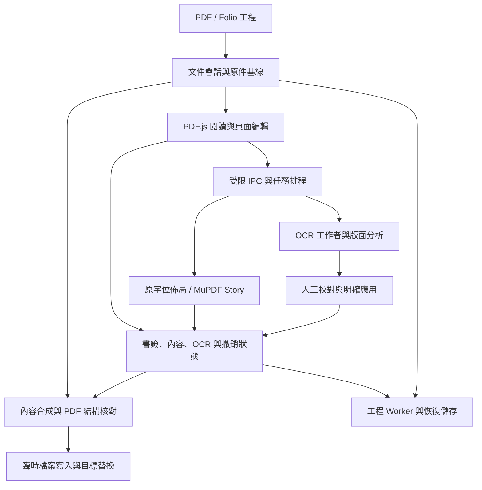

# Folio PDF Studio

[English](README.md) · [简体中文](README.zh-Hans.md) · **繁體中文**

> **1.6.0 正式通道**：英文預設介面、簡體/繁體中文即時切換、離線語言包，以及多語言 README 和發行說明。
> [下載 1.6.0](https://github.com/ionize1080/Folio/releases/tag/v1.6.0) · [釋出說明與限制](docs/RELEASE-1.6.0.zh-Hant.md) · [驗收入口](docs/VALIDATION.md)。釋出附件由同提交 Windows 驗收門控；以本版附件報告為準。

面向 Windows x64 的離線 PDF 工作臺，重點解決長文件的**書籤生成與整理、頁面內文字編輯、OCR 識別與校對**。閱讀、版面分析、字型匹配和 OCR 在本地執行；完整便攜包無需另裝 Python、Node.js 或模型。

[已實現功能](#已實現功能) · [專案架構](#專案架構) · [已知問題](#已知問題與適用邊界) · [下一步計劃](#下一步功能計劃) · [開發與測試](#開發構建與測試)

## 介面語言

新使用者和尚未選擇語言的舊使用者預設使用英文，不隨系統語言自動切換。頂部常駐地球圖示和語言名稱，可直接選擇 **English / 簡體中文 / 繁體中文**；首選項提供同一設定。選擇立即生效並儲存在本機，無需重新開啟文件。

語言切換保持未儲存的編輯、輸入框內容和文件狀態，不翻譯 PDF 正文、書籤標題或 OCR 校對內容，也不改變 OCR 識別語言和輸出字形。Windows 原生檔案對話方塊遵循系統語言，底層引擎/系統診斷可能保留原始技術文字。淺色和深色主題均支援鍵盤操作的語言控制元件。

## 新增使用入口

- **編輯影象**：主工具欄點選後，在 PDF 頁面選中圖片。側欄內調引數，原位預覽，應用或完成後儲存 PDF；取消放棄尚未應用的調整。
- **檢查更新**：關於/使用說明 → 檢查更新。支援正式版/包含預釋出，首選項 HTTP 代理共用，下載校驗後安裝並重啟。程式目錄保持不變，舊版保留同級備份。1.2.2 首次升級仍需手動下載，1.3 起支援軟體內更新。
- 本版覆蓋截圖中的 18 類調整專案，演算法採用 Folio 的獨立 RGB 實現；精確範圍與 Photoshop 差異見釋出說明。

## 下載與使用

在 Release 頁面按用途下載：

| 檔案 | 用途 |
| --- | --- |
| `Folio-PDF-Studio-1.6.0-portable-win-x64.zip` | 完整便攜包，解壓後執行 `Folio.exe` |
| `Folio-PDF-Studio-1.6.0-source.zip` | 完整離線原始碼與隨包執行資源 |
| `Folio-PDF-Studio-1.6.0-validation.json` | 同提交 Windows 迴歸及公開樣本結果 |
| `Folio-PDF-Studio-1.6.0-SHA256.txt` | 附件校驗值 |

請保留解壓後的完整目錄，包括 `resources`、`locales` 和 DLL。GitHub 自動生成的 **Source code (zip/tar.gz)** 是倉庫快照，與上述完整離線 `source.zip` 的資產範圍不同。

歷史 RC 附件及備份保留；舊版本驗收記錄不作為本版透過證據。

基本流程：開啟或拖入 PDF → 編輯書籤、頁面內容或校對 OCR → 應用修改 → 儲存 PDF。“完成編輯”或“應用修改”更新當前會話，**仍需儲存檔案**。需要繼續調整段落結構、OCR 校對和內容編輯時，透過“更多工具 → 匯入 / 匯出”儲存 `.folio` 工程。

| 快捷鍵 | 操作 |
| --- | --- |
| `Ctrl+O` / `Ctrl+S` / `Ctrl+Shift+S` | 開啟 / 儲存 / 另存為 |
| `Ctrl+F` / `F3` / `Shift+F3` | 搜尋正文 / 下一個 / 上一個結果 |
| `Ctrl+Z` / `Ctrl+Y` | 撤銷 / 重做，輸入期間優先作用於當前段落 |
| 移動手柄方向鍵 / `Shift`＋方向鍵 | 1 pt / 10 pt 微調文字框；輸入文字時不移動文字框 |
| `Shift`＋拖動文字框 | 按主位移約束水平或垂直 |
| `Ctrl+Enter` | 頁面編輯中完成當前段；OCR 校對中確認並前往下一處 |
| `Ctrl+Shift+B` | 從選中文字或當前檢視新建書籤 |
| `F2` / `Delete` | 書籤樹中改名 / 刪除所選子樹 |
| `Ctrl+0` / `Ctrl+1` / `Ctrl+2` | 適合頁面 / 實際大小 / 適合寬度 |
| `Alt+←` / `Alt+→` | 閱讀區返回 / 前進；書籤樹中用於升降級 |

快捷鍵按所在區域解釋，可在首選項中配置。當前主要交付平臺為 Windows x64；Linux 上的引擎或瀏覽器測試不等於提供 Linux 桌面發行版。

## 已實現功能

以下基礎功能沿用 P6/P7；本版新增及修復見 [1.6.0 釋出說明](docs/RELEASE-1.6.0.zh-Hant.md)。功能存在並不表示任意 PDF 都能無損處理；複雜結構和已知缺陷單獨列在後文。

### 1. 閱讀、定位與日常文件操作

- PDF 閱讀、縮放、適合頁面/寬度、連續瀏覽、縮圖與檢視前進/返回。
- 正文搜尋、文字選擇與複製、書籤導航；可收起的書籤側欄和屬性面板，明暗主題。
- 頁面與高倍縮放瓦片按需渲染，使用快取預算、縮放錨點和過期渲染取消降低長文件開銷。
- 拖入 PDF 或 Folio 工程，切換文件前處理未儲存更改；多檔案拖入時選擇要開啟的檔案。
- 基礎批註、指定頁面旋轉、頁面提取、末尾追加另一 PDF、當前頁 PNG 匯出與文件屬性編輯。
- 加密文件的密碼處理；透過 qpdf/pikepdf 匯出無密碼副本，錯誤密碼可重試，取消不寫檔案。

**頁面工具的範圍：**提取以原始文件為基礎，不包含尚未另存的修改，也不復制整本書籤樹；追加 PDF 前先儲存當前編輯，追加檔案的書籤不自動合併。PNG 匯出以頁面畫布為基礎，未儲存批註應先儲存並重新開啟後再匯出。

**大檔案工作區：**超過 768 MiB 的 PDF 自動進入獨立通道，上限 8 GiB，支援按頁閱讀、跳頁/縮放、書籤增刪改/撤銷、正則自動書籤預覽追加及另存。當前不提供連續滾動、正文選區/全文搜尋、頁面編輯、OCR、工程或自動草稿恢復；關閉後回到普通會話。大於 4 GiB 的稀疏樣本驗證了偏移處理，尚不代表數 GB 真實年鑑的吞吐和記憶體驗收。

### 2. 書籤建立、批次編輯與自動生成

書籤是核心工作流，**自動書籤入口常駐主工具欄**。

| 能力 | 當前實現 |
| --- | --- |
| 樹形編輯 | 新增同級/子項、改名、刪除、多選、剪下/複製/貼上、拖動排序、跨層移動、升降級、展開/摺疊 |
| 屬性與目標 | 批改粗體、斜體、顏色，以及可編輯目標的頁碼、座標和縮放；保留並核對原始動作來源 |
| 篩選 | 標題文字或正則、大小寫選項、物理頁碼；可選擇真正匹配項並批次處理，祖先路徑用於保持上下文 |
| 批次規則 | 查詢替換、目標引數調整、修改前後詳情預覽、報告匯出與整批撤銷 |
| 自動生成 | 自定義多層級規則、捕獲組標題、文字來源選擇、當前頁測試、頁範圍掃描預覽；支援字號、目錄文字和頁間隔等入口 |
| 文字重組 | 同行片段拼接與可調基線容差，可選相鄰跨行標題合併；提供命中、忽略、衝突與缺少父級診斷 |
| 插入與去重 | 根層追加、替換、插入所選前後或作為子項；生成時跳過重複匹配，整理時按標題、頁碼及目標位置容差去重 |
| 正則拆分 | 同級分隔、獨立規則提取和父子層級拆分；規則讀取完整原題，支援預覽、子項遷移及目標繼承 |
| 目標校準 | 在頁面文字中定位候選並核對匹配片段，允許保留人工選擇及原目標 |
| 跳轉留白 | 按視覺留白調整頂部位置，支援 mm/pt、所選/所選及子項/全部範圍，預覽跳轉前後差異 |
| 規則記憶 | 按操作與文件恢復引數，最近規則、命名收藏及匯入/匯出；恢復規則後重新計算預覽 |
| 交換格式 | 匯入/匯出 Folio JSON 和目錄 TXT；未實現 PDF-XChange 專有書籤交換格式 |

座標、留白與頁範圍在預覽中核對後應用。跨檔案匯入不會照搬原始動作字典：可解析本地目標轉為顯式目標，不可解析動作會提示並回退定位，不能承諾跨檔案動作完全等價。

### 3. 頁面內段落編輯與字型處理

- 直接在閱讀區點選段落編輯，支援輸入、退格、拖選、複製貼上及新建文字；輸入法組合階段保留草稿。
- 支援字元範圍的字型、字號、粗斜體、顏色，以及段落對齊、行距、段前後距、縮排和格式刷。
- 字型列表按文件、內建、系統和最近使用組織，提供本地化名稱、別名搜尋、真實樣例與 TTC 字面選擇。
- 保留原始字元原點、基線和邊界。滿足條件的小修改嘗試保持原字位；需要重新佈局時使用 MuPDF Story，並明確進入段落重排。
- 對單物件、單行、等字元數、已有編碼且不增寬等受限情形，支援保持原字型資源的區域性糾錯；不滿足條件時採用內容片段路徑。
- 支援段落拆分、合併、人工結構鎖定，同頁文字框連線、順序調整和斷開，以及同一文字流內的分欄續排。
- 文字框支援位置、尺寸、固定範圍和擴充套件方向設定；碰撞、溢位和頁外內容預設僅通知，可繼續輸入、選擇、撤銷和儲存，詳情按需展開；單元格預設保持邊界，擴充套件由使用者明確選擇。
- 提供段落原文對照、字型替代明細，以及全頁並排、疊加和畫素變化網格對照。

**RC1-P6 的改進：**使用字型原始分數字寬，能放入原行的區域性編輯優先保持其他行字位；恢復多種 PDF 嵌入字型並校驗 CID/連字的實際匯出字形。字型推薦使用有界單字形快取並過濾過期響應。首次匹配仍有開銷，本次 45 字型實測的冷請求沒有改善，首字元變化後的推薦耗時下降約 45%。

現有字型匹配使用覆蓋、輪廓、形狀和字寬資訊。**未嵌入字型解析與混合字型保真仍存在已知問題**，並非任意原字型均能無損續寫。

### 4. 圖片、物件與簡單表格

- 圖片支援亮度/對比度、直方圖與色階、曲線、模糊、銳化、掃描增強和原圖對照。
- 提供文字、路徑等物件的受限編輯入口；圖片例項可替換、設定適配方式和可恢復裁切，保留源圖供工程續編。
- 簡單有線表格支援單元格文字、行高聯動、行列插入/刪除、列寬調整、矩形合併/拆分、排版預覽及撤銷。
- 表格可匯出 CSV 和 XLSX。XLSX 單元格按文字寫入，保留前導零、長編號、日期原文和合並範圍；CSV 處理引號、換行及易被解釋為公式的開頭。
- 表格結構調整約束在當前區域內，空間不足或物件對映不可靠時提示或保留原內容。複雜無框線、傾斜、巢狀及跨頁表格不屬於已完整支援範圍。

### 5. 離線 OCR、校對與雙層 PDF

| 環節 | 當前實現 |
| --- | --- |
| 識別引擎 | RapidOCR + ONNX Runtime CPU；提供 PP-OCRv6 small 和 PP-OCRv5 mobile 配置 |
| 範圍與資源 | 指定頁範圍或框選區域性區域；180/240/300 DPI；自動、低佔用、高效能和自定義並行頁數/執行緒/文字行批次 |
| 診斷與方向 | 保留檢測框、低分/空結果和過濾診斷；疑難框提供 0°/180°候選，穿越表格線等疑點交人工確認 |
| 排程 | 獨立 OCR 工作者、逐頁進度、停止保留結果，以及相同文件和設定的已完成頁續做 |
| 跳過策略 | 依據已有文字覆蓋判斷是否跳過，或選擇“任意已有文字”的舊策略；區域性區域有獨立處理邏輯 |
| 校對 | 單頁/連續滾動模式，文字與頁面雙向定位、疑點跳轉、確認下一處、暫緩、人工修改與校對草稿恢復 |
| 語言與字形 | 簡中、繁中、英文等校對提示選項；保留其他識別文字；可保留原結果或轉換簡繁字形 |
| 輸出 | 應用校對結果生成可搜尋、可複製的隱藏文字層，保留掃描影象；提供文字/識別框預覽 |
| 重複應用 | 新建 OCR 層帶 Folio 標識，重新開啟後可替換已知 Folio 層；不會自動刪除其他軟體產生的隱藏文字層 |

語言勾選用於校對提示，**不擴充套件模型本身的語言能力**。字形轉換髮生在識別之後，原始識別文字和引擎置信度仍保留。修改隱藏 OCR 層不會直接修改掃描圖上的可見文字。

當前已支援框選區域性識別及疑難框方向候選；未確認疑點不能直接寫入最終文字層。下一步計劃中的“補識別”進一步要求複用既有檢測框、比較候選、保護人工校對並可靠合併結果，兩者不能等同。

### 6. 儲存、工程、撤銷與恢復

- 原始 PDF 作為會話基線儲存，書籤、旋轉、批註、OCR 和內容修改作為獨立狀態參與合成。
- `.folio` v2 使用 ZIP STORE 容器，包含原 PDF、狀態、內容資產及雜湊清單；支援讀取舊版 v1 工程，儲存為 v2 後舊版程式不能讀取。
- 大型 OCR/內容片段透過不可變版本引用參與歷史，減少撤銷記錄中的重複序列化；當前編輯與文件操作分別提供撤銷/重做。
- 工程編解碼放到 Worker，桌面儲存按塊傳輸；寫入同目錄臨時檔案並刷盤後替換目標，失敗時保護原目標內容。
- IndexedDB 儲存按會話區分的恢復草稿，源文件和碎片去重並檢查完整性；可選擇、恢復或刪除草稿。
- 損壞工程、資產缺失或恢復校驗失敗會停止切換/恢復；配額失敗保留上一次完整快照。

工程儲存原始內容、編輯狀態和非阻斷提示，適合續編。完成編輯僅生成修改頁預覽，儲存時合成完整 PDF。普通 PDF 輸出不保證重新開啟後還能恢復同一段落編輯模型；普通編輯和保留歷史的工程也不是安全塗黑。

## 專案架構

### 技術棧與分工

| 層次 | 技術 / 模組 | 職責 |
| --- | --- | --- |
| 桌面容器 | Electron、`main.cjs`、`preload.cjs` | 視窗、檔案互動、受限 IPC、原生任務與執行資源管理 |
| 頁面工作區 | ES modules、HTML/CSS、PDF.js | 閱讀渲染、文字選擇、編輯游標、書籤樹、OCR 校對和屬性互動 |
| 結構與計算 | pdf-lib、Web Workers | PDF 結構、書籤與批註寫入，規則計算、篩選、工程編解碼 |
| 原生 PDF | Python、pypdfium2/PDFium、PyMuPDF、pikepdf/libqpdf | 物件解析、字形幾何、內容合成、排版輸出及解密 |
| 確定性排版 | 原字位佈局、MuPDF Story | 區域性修改和受控段落重排，輸出對應的預覽及 PDF 片段 |
| 本地識別 | RapidOCR、RapidLayout、ONNX Runtime、PicoDet CDLA | OCR 和版面區域候選；不使用生成模型自動改寫正文 |
| 狀態與持久化 | 會話修訂號、內容定址資產、ZIP 工程、IndexedDB | 過期結果拒絕、撤銷、快取、工程儲存及異常恢復 |

### 執行鏈路



閱讀渲染、PDF 結構處理、排版及 OCR 分工協作。原生橋在單個程序內序列請求，不同工作程序隔離內容、背景、字型、排版及 qpdf 等任務；OCR 另有頁級排程。取消代次和文件修訂號用於拒絕過期結果，但已進入某次原生呼叫的工作不一定能立即中斷。

### 主要原始碼入口

| 檔案 / 目錄 | 主要職責 |
| --- | --- |
| `main.cjs`、`preload.cjs` | 桌面啟動、IPC 傳送者校驗、檔案能力票據、原生程序入口 |
| `src/app.mjs`、`src/session-state.mjs` | 命令協調、活動文件、對話方塊、文件身份與修訂號；`app.mjs` 仍較集中，尚未完成全面模組化 |
| `src/viewer.mjs` | 頁面/瓦片虛擬化、渲染快取、縮放錨點和選擇 |
| `src/bookmark-*.mjs`、`src/generation.mjs`、`src/text-lines.mjs` | 書籤樹、屬性、篩選、去重/拆分、文字重組與規則生成 |
| `src/*-worker.mjs` | PDF 結構、規則生成、批次處理、篩選、校準和工程等後臺計算 |
| `src/flow-ui.mjs`、`src/flow-model.mjs`、`src/flow-page-model.mjs`、`src/flow-structure.mjs` | 頁上編輯、字元/段落模型、選區、文字框接續及結構修正 |
| `src/fast-layout.mjs`、`native/fast_layout.py`、`native/browser_fonts.py`、`native/font_sfnt.py` | 快速編輯字位、實際 PDF 字形寫回、嵌入字型修復與瀏覽器載入 |
| `src/page-preview.mjs` | 修改頁預覽、共享原 PDF 與撤銷時的資源所有權 |
| `large-files.cjs`、`native/large_pdf.py`、`src/large-workspace.mjs` | 大檔案受控控制代碼、按頁渲染、獨立書籤工作區和增量另存 |
| `flow-layout.cjs`、`flow-validation.cjs` | 專用排版程序與輸入模型校驗；產品路徑不再依賴舊 Chromium 排版器 |
| `native/original_layout.py`、`native/original_patch.py`、`native/story.py` | 原字位與區域性行佈局、受限原物件糾錯、Story 段落排版 |
| `native/font_match.py`、`native/font_similarity.py`、`native/system_fonts.py` | 字型解析、覆蓋檢查、候選字形比較與系統字型資訊 |
| `native/content.py`、`native-bridge.cjs` | 原物件來源校驗、版本化內容片段合成、請求隔離與結果快取 |
| `ocr-jobs.cjs`、`native/worker.py`、`src/ocr-*.mjs` | OCR 頁任務、引擎執行、結果傳輸、校對狀態和應用 |
| `src/table-*.mjs`、`native/table_*.py`、`native/image_edit.py` | 表格模型、結構/尺寸調整、輸出和圖片例項處理 |
| `src/pdf-core.mjs`、`src/pdf-worker.mjs` | PDF 結構儲存、書籤動作保真與合成來源核對 |
| `source-store.cjs`、`src/native-source.mjs` | 原 PDF 註冊、只讀控制代碼及租約，減少重複全檔案傳輸與落盤 |
| `src/model.mjs`、`src/edit-assets.mjs`、`src/portable-state.mjs` | 小狀態歷史、不可變內容版本、內容定址資產和資源預算 |
| `src/project.mjs`、`src/project-worker.mjs`、`src/zip-store.mjs` | v2 工程容器、清單校驗、Worker 編解碼及 v1 相容讀取 |
| `src/recovery.mjs`、`src/ocr-review-store.mjs` | 會話恢復、去重儲存、配額處理與 OCR 校對草稿 |
| `file-store.cjs`、`temp-store.cjs` | 檔案選擇票據、分塊寫入、原件保護與帶所有者資訊的臨時目錄清理 |
| `scripts/`、`tests/`、`.github/workflows/` | 資源恢復、構建、迴歸、打包驗證和釋出流程 |

### 資料與儲存約束

`.folio` v2 的主要條目為 `source.pdf`、`state.json`、`assets/<sha256>.pdf/json` 與 `manifest.json`。PDF 片段不再進行無效重複壓縮，讀取時檢查條目、格式和雜湊。當前工程路徑的源 PDF 上限為 768 MiB，工程上限為 1 GiB；恢復儲存設有 1 GiB 資源配額。獨立大檔案通道不進入上述完整位元組陣列與工程路徑，其 8 GiB 上限只適用於已列出的閱讀/書籤能力。這些限制及歷史預算**不是整個應用程序記憶體的硬上限**。

儲存先合成內容，再驗證原始書籤動作來源和語義，最後寫入 PDF 結構並替換目標檔案。無法證明安全的物件修改會被拒絕或使用片段路徑；能顯示一個 PDF 不代表其所有結構都能無損重寫。

更完整的實現說明見 [當前架構](docs/ARCHITECTURE.md)。

## 已知問題與適用邊界

本輪修復和方法依據見 [P6 編輯審計](docs/RC1-P6-editor-audit.md)。目前仍保留以下限制：

| 問題 | 已確認現象 / 邊界 |
| --- | --- |
| 重開後的段落拆分 | 65 個最終檔案中，58 頁的目標仍在單個編輯塊內，GNU/RFC/論文/Unicode 的 7 頁目標被拆成多個塊；文字保留，連續編輯體驗仍需改善 |
| 複雜字形和方向 | 5 個混排用例涉及旋轉方向或複雜字元合成粗斜體，保留草稿並提示使用支援的方向或真實字型 |
| 空白與換行 | 65 頁中保留詞間空白的完整目標檢查透過 51 頁，保留換行的逐字檢查透過 48 頁；文字搜尋成功不等於程式碼格式保真 |
| 原樣保持 | 43/65 個最終樣本沒有超過 1 pt 的未改字元移動；放不下的區域性插入和擴寫仍會重排，不能保證任意修改都保持全部字位 |
| 特殊字型與結構 | Type3、不能核驗的字元編碼/閱讀順序和非 1 UserUnit 等仍受限；保留原物件並解釋原因 |
| 首次編輯與字型推薦 | 快取主要改善重複請求和編輯後複用，首次頁面分析及冷字型推薦仍需時間；未將 45 字型結果外推為千字型保證 |
| OCR 完整性 | 本輪重點為頁面文字編輯；OCR 的框內漏字、低分過濾和跨格合併仍需按疑難樣本繼續複核，不能把引擎高置信度當作內容完整 |

幾何通知非阻斷，內容歸屬、字位對映或字型覆蓋無法確認時仍保留草稿並拒絕不可靠寫回。頁外文字可以繼續編輯，匯出仍受原紙張大小裁切。

其他當前邊界：

- 同頁文字框連線和同一文字流分欄已實現；跨頁文章級自動續排、任意圖文繞排仍未完成。
- 頁面佈局模型提供候選區域，不能替代完整語義結構；公式結構編輯、全文 DOCX/HTML/Markdown 結構化匯出尚未實現。
- 表單編輯、安全塗黑、數字簽名及 PDF-XChange 專有書籤格式未實現。對含簽名 PDF 的重寫可能影響原簽名有效性。
- 隱藏 OCR 層的校對不等於掃描影象可見文字編輯；其他來源的文字層不會被無條件刪除。
- Windows 自動化驗證已透過，但真實中文輸入法、混合 DPI 及所有 Windows 10/11 硬體組合未全部覆蓋。

## 下一步功能計劃

以 [P6 後續計劃](docs/NEXT-RELEASE-PLAN.md) 為統一入口。近期優先項：

1. 儲存並核驗自有內容層的段落歸屬、邏輯空格和換行，解決儲存重開後拆段及程式碼格式變化。
2. 補齊複雜方向、字元整形和特殊字型邊界；繼續保護未修改字元、原物件及其他頁面。
3. 在已有 OCR 診斷和方向候選上完成區域性補識別、人工校對保護及可靠合併，並複核漏字和跨格樣本。
4. 測量並改善首次分析、字型冷請求、長文件預覽/儲存及真實多 GB 檔案表現；繼續拆分集中模組。
5. 補做真實 Windows 中文輸入法、混合 DPI、強退恢復和不同記憶體配置驗收。

跨頁文章續排、複雜表格、公式結構編輯和 DOCX/HTML/Markdown 輸出仍屬後續方向。所有計劃與已實現功能分開記錄。

## 開發、構建與測試

### 環境與資源

當前 Windows CI 使用 Node.js 24、Python 3.12 和 `package-lock.json`。原生依賴見 [tests/requirements.txt](tests/requirements.txt)，隨包資源版本及許可見 `native/runtime-lock.json` 和 [第三方說明](THIRD-PARTY-NOTICES.md)。

```sh
git clone https://github.com/ionize1080/Folio.git
cd Folio
npm ci
python -m pip install -r tests/requirements.txt
python -m pip install --target native/vendor fonttools==4.61.1
npx playwright install chromium
python scripts/restore-assets.py
```

`restore-assets.py` 按 `native/models/manifest.json` 下載並校驗固定模型；已存在且雜湊正確時複用，下載失敗或校驗不符會停止。首次準備開發環境需要下載依賴；完整便攜包的日常執行不需要此步驟。

Windows 完整打包還需隨包執行時、字型和原生元件。以 [.github/workflows/folio-v16.yml](.github/workflows/folio-v16.yml) 為本版構建與驗收參考，包括 fontTools 許可檔案的複製步驟。`npm start` 啟動開發介面，原生功能要求相應執行資源齊備。

### 命令

| 命令 | 用途 |
| --- | --- |
| `npm start` | 啟動 Electron 開發應用 |
| `npm run test:unit` | 純 JavaScript 單元迴歸 |
| `npm test` | 標準迴歸入口：JS、原生 PDF/OCR、OCR 排程與瀏覽器介面 |
| `npm run test:native` | 原生引擎及相關排程迴歸 |
| `npm run test:ui` | 生成所需樣本後執行介面迴歸 |
| `npm run test:documents` | 外部真實 PDF 專項驗證，不將使用者文件隨倉庫分發 |
| `npm run build:win` | 構建 Windows x64 包 |
| `npm run test:package` | 構建後核對 PE 資訊、程式內容及執行資產 |
| `python tests/editor-p6.py` / `python tests/public-corpus-p6.py` | P6 原生專項 / 10 份公開文件 50 頁檢查；需先準備依賴和固定語料 |
| `node tests/electron-p6.cjs` | P6 實際 EXE 的頁外編輯、通知、字型載入及儲存重開驗收 |
| `node tests/electron-v12.cjs` | 使用 `FOLIO_EXE` 指向打包程式，驗證實際 EXE 的啟動、原生編輯及儲存 |

可配置 `FOLIO_PYTHON` 指定直譯器、`FOLIO_CHROMIUM` 指定測試瀏覽器、`FOLIO_FIXTURES` 指定真實文件目錄。複用離線 Windows 便攜基線時，設定 `FOLIO_RUNTIME_BASE` 為解壓目錄、`FOLIO_RUNTIME_BASE_ZIP` 為對應 ZIP；打包指令碼校驗執行時並重新裝入業務原始碼及引擎。

本版 Windows 工作流為 `folio-v16.yml`，觸發分支為 `codex/folio-v16-i18n`，同時提供手動觸發。P6 等歷史工作流保留供追溯。`npm test` 包含舊版迴歸，但不會單獨執行全部 P6 專項、公開語料和打包 EXE 檢查；本版驗收以 v16 工作流為準。任意主線文件提交不等於重新跑過全部 Windows 驗收。

### 歷史驗證與版本追蹤

- **P6 程式基線：**`0b1cfa0cfb685f8d8bbd5ee04b0042574a85a8d5`，對應 [Windows 成功執行 35818217755](https://github.com/ionize1080/Folio/actions/runs/35818217755)。127 項 JS 單元測試、13 項 P6 原生專項、舊版本回歸、公開語料和實際 EXE 驗收透過。
- **釋出產物核驗：**8 份 Windows 驗收記錄無錯誤，178 項字型載入檢查透過，4 組打包 EXE 驗收使用相同 EXE 與 `app.asar` 雜湊。釋出附件中的驗證 JSON 保留原始記錄。
- **本地實文件複驗：**13 份文件 65 頁、2,111 個操作檢查點（含複測）；平臺與保真指標分別記錄，不等同於 Windows 人工驗收或全部用例無差異。
- **2026-09-23 主線同步：**P6 功能此前已在 main；本次合入釋出分支的指令碼並同步文件，程式原始碼不變。原分支、Release 附件與後設資料獨立備份，詳見 [同步記錄](docs/RELEASE-SYNC-2026-09-23.md)。
- **歷史記錄：**[P1](docs/PATCH-1.2-RC1-P1.md)、[P4](docs/editor-p4-validation.md)、[P5](docs/RC1-P5-editor-audit.md) 和 [RC1](docs/VALIDATION-1.2.md) 保留各自當時的基線，不作為當前能力的唯一依據。

## 文件與許可

- [1.2 更新說明](docs/CHANGELOG-1.2.md)
- [P6 釋出說明](docs/RELEASE-P6.md)
- [P6 編輯審計](docs/RC1-P6-editor-audit.md)
- [P6 後續計劃](docs/NEXT-RELEASE-PLAN.md)
- [主線同步與備份](docs/RELEASE-SYNC-2026-09-23.md)
- [當前架構](docs/ARCHITECTURE.md)
- [當前驗證範圍](docs/VALIDATION.md)
- [1.1 功能更新](docs/CHANGELOG-1.1.md)
- [第三方元件與許可](THIRD-PARTY-NOTICES.md)

Folio 自有程式碼採用 [MIT License](LICENSE)。組合分發包含 PyMuPDF/MuPDF 等 AGPL 元件，以及各自許可下的字型、模型和執行時；根目錄 MIT 不覆蓋或重新授權這些第三方元件，`package.json` 的組合 SPDX 表示式也不替代逐元件許可檔案。

當前應用沒有遙測；檢查和下載更新時訪問 GitHub，文件處理和介面翻譯均在本地完成。本地模型參與 OCR 和版面候選分析，不自動生成或改寫文件正文。
