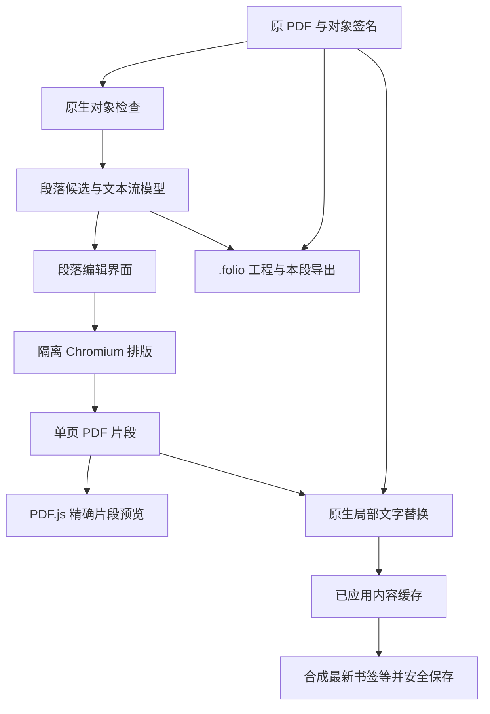

# 0.6.0 架构增量

保留原有 `ARCHITECTURE.md` 描述的 Electron + PDF.js 阅读、pdf-lib 结构编辑、PDFium/pypdf 原生内容写回与 OCR 任务服务。新增流式编辑与内容结果复用。

| 模块 | 责任 |
|---|---|
| `src/flow-model.mjs` | 基于原生对象边界、行距、字号构建候选，保留索引和签名；文本流模型、导出 HTML |
| `src/flow-ui.mjs` | 候选选择/合并、全段样式、同页等高分栏、预览、溢出反馈、续编 |
| `flow-layout.cjs` | 输入与字形检查、离线私有文件页面、窗口/字体复用、测量溢出与 printToPDF、临时目录生命周期 |
| `native/content.py` | 验证来源和完整共享文字组，移除原始文字绘制，复用 PDF 片段资源为 Form；补偿打印页面舍入 |
| `native-bridge.cjs` | 原件与不可变操作输入散列、应用结果磁盘缓存，保留两版并在退出清理 |
| `src/project.mjs` | folio-project/1 编解码，内嵌原 PDF、SHA-256 与状态；去除临时 OCR 快照引用 |
| `src/text-lines.mjs` / `src/generation.mjs` | 视觉同行与来源片段映射、间距分类、标题捕获组及目标定位 |
| `src/region-select.mjs` | 一次框选、指针捕获、坐标限制与 Esc 取消；OCR 和复制共用 |
| `src/viewer.mjs` | 基础画布/高清分块、有界缓存、附近预取、旧清晰画面保留与任务合并 |
| `src/pdf-core.mjs` / `file-store.cjs` | 已应用内容上的结构合成、原动作引用重映射、安全输出目标票据与临时写入替换 |

文本流模型包含 pageWidth/pageHeight、frame、text、size、lineHeight、columns、gap、color、alignment、粗斜体、sources。操作另保存原始签名与生成的 PDF fragment；重做和续编从原始基线重建一次，避免一层层重复覆盖。

初版选择原生几何分析 + 已有 Chromium；没有新增 AI 运行依赖或 Story。未来结构模型可增加段落内 runs、跨页 frame 链、公式 AST、表格单元格与阅读顺序，再接入本地版式分析器。分析器仅提出结构候选，确定性排版与原始内容核对仍是写回门槛。

`.folio` 是可移植未压缩 JSON 工程，带完整原件与修改状态；不是 PDF 增量格式或自动脱敏格式。普通 PDF 成品里的 Form 片段不能保证再被重建成相同的编辑模型。
