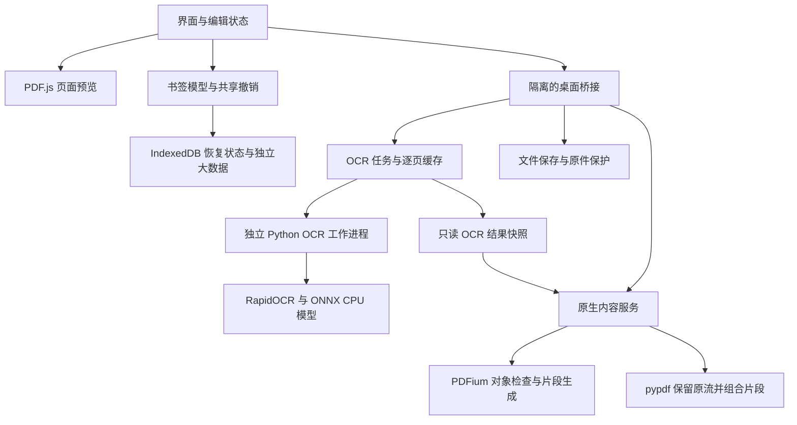

# Folio PDF Studio 0.5.0 源码架构

## 主链路

## 模块职责

| 文件 | 职责与边界 |
|---|---|
| `main.cjs` / `preload.cjs` | Electron 隔离窗口、窄 IPC、发送者校验、原生进度事件；前端不持有任意本地文件写入权限 |
| `file-store.cjs` | 原件保护、活动副本、同目录临时写入和原子替换；成功后才更新活动路径 |
| `src/app.mjs` | 文档状态、命令、对话框、预览重建和保存；书签/批注等使用原始 PDF 引用模型 |
| `src/model.mjs` | 扁平前序书签树、验证和整棵子树操作；小状态序列化，OCR 结果不可变共享 |
| `src/recovery.mjs` | IndexedDB v2；文档与 OCR 作为独立大数据保存，较小元数据逐次更新 |
| `src/viewer.mjs` | 页面虚拟化、瓦片绘制、缩放锚点、取消过期任务与视图历史 |
| `src/generation.mjs` / `generate-worker.mjs` | 每层正则、冲突和孤立层级处理；耗时规则在可终止 Worker 中执行 |
| `src/bookmark-tools.mjs` / `bookmark-ui.mjs` | 多选样式、范围去重、目标校准和交互 |
| `src/page-picker.mjs` | 统一物理页范围、预设、缩略图窗口和页标签 |
| `src/ocr-data.mjs` | 不可变 OCR 版本的逐页索引，避免翻页、预览和书签生成反复扫描全书结果 |
| `src/text-lines.mjs` | 原生/OCR 文字几何、重叠抑制、分栏和可选跨行合并 |
| `src/ocr-ui.mjs` | 当前页校对、草稿捕获、请求版本校验、状态增量、字体问题与应用进度 |
| `ocr-jobs.cjs` | 文档/配置缓存标识、逐页原子结果、实测内存调度、校对保存、语言字形转换、结果引用 |
| `native-bridge.cjs` | 串行 JSON-lines 请求、原生进度、多进程退出和取消 |
| `native/worker.py` | OCR 文档/模型复用、阶段耗时、字形预检、PDFium 检查与新片段生成 |
| `native/content.py` | 原内容流对象对应验证、局部替换、独立 Form 片段、字体流复用；复杂结构保守拒绝 |
| `native/memory.py` | Windows/Linux 常驻内存采样，不依赖 psutil |
| `src/pdf-core.mjs` / `pdf-worker.mjs` | pdf-lib 书签、批注、元数据、旋转等结构写入；保持源对象引用 |

## 保存与撤销

打开时的 `S.bytes` 作为不可变源 PDF。书签、批注、旋转、原生对象修改及 OCR 结果记录为声明式编辑状态。预览用独立 PDF，避免破坏原始对象编号。最终先写入结构修改，再组合原生文字/路径与 OCR 文字层；磁盘保存成功才更新活动文件。

OCR 校对只加载当前页条目；全书结果在应用时形成不可变版本，并由书签生成共享读取。原生应用通过主进程生成的结果引用读取 JSONL。撤销复用未变的结果数组，不在每一步复制全文。恢复状态使用独立大数据，重启后不信任旧进程中的结果引用，重新从恢复数据生成预览。

## 内存与限制

页面画布有缓存边界，OCR 工作者按实测常驻内存调整，但整份 PDF 解析/保存、结构化 OCR 状态和某个单页的结果仍驻留内存。多次应用产生不同的结果版本，历史会按估算预算淘汰较早步骤，至少留下最近一步。任务/快照磁盘文件尚无自动配额。

语言偏好只影响提示和显式字形转换。当前依然是随包 PP-OCR 模型、ONNX CPU 推理；不会自动下载其他模型。文本框换行使用 PDFium 字形度量，未引入 Story 或 PyMuPDF 运行依赖。
